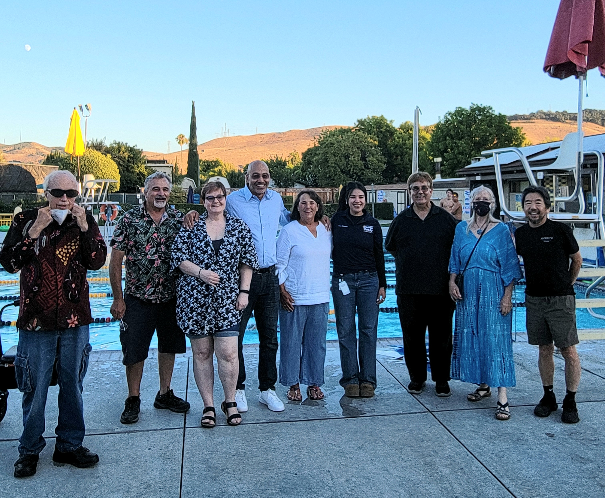

# Community Building Committee

## Purpose

The Community Building Committee focuses on enhancing the physical and social environment, fostering connections among neighbors as outlined in our mission.
Roles and Duties

## Roles and Duties

* Community Events: Plan and facilitate events that foster community spirit and interaction among residents.
* Volunteer Coordination: Recruit and manage volunteers for beautification and community-building activities.
* Resource Management: Identify resources and funding opportunities to support beautification efforts.

----

Currently our biggest community event is National Night Out. We participated in it last year and will do so again this year. 

If you are interested in planning and facilitating community events, please contact us at ranchostna@gmail.com. Attention of Community Building Committee.

