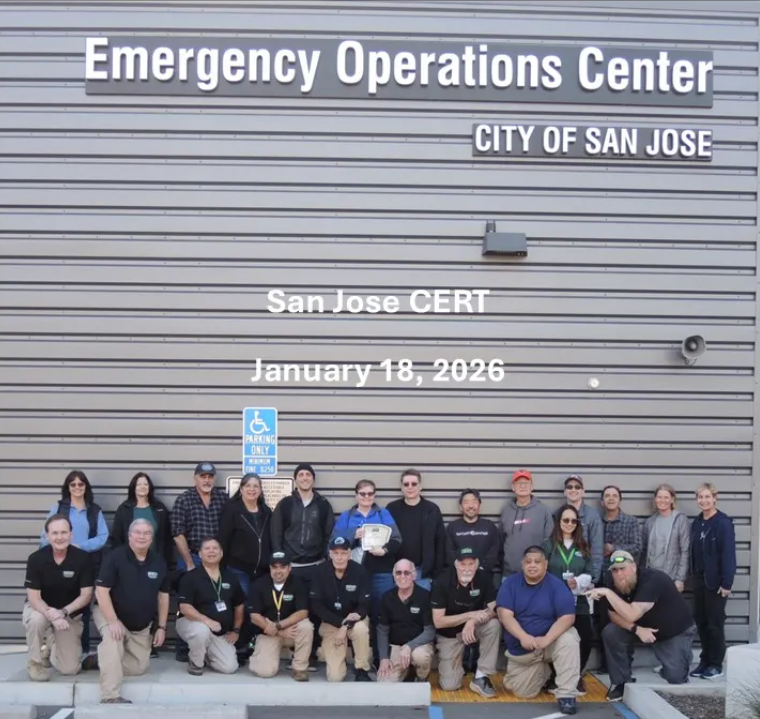

# Emergency Preparedness Committee

## Purpose
The Emergency Preparedness Committee equips residents with the knowledge and resources necessary to respond effectively to emergencies, contributing to the overall safety and resilience of the community.
## Roles and Duties
* Preparedness Training: Organize workshops and training sessions on emergency preparedness and response.
* Resource Distribution: Ensure the availability and distribution of emergency supplies and resources.
* Emergency Plans: Develop and maintain neighborhood-specific emergency plans and protocols.
* Coordination with Authorities: Collaborate with local emergency services to enhance community preparedness efforts.

----

Several of our members have graduated from the [CERT basic training](https://www.sanjoseca.gov/your-government/departments-offices/office-of-the-city-manager/emergency-management/be-trained/community-emergency-response-team-training). A few more are in the process of getting certified. This is an ongoing process, and the more people in the community and neighborhood that know how to prepare for and react in a disaster, the better.

If you are interested in emergency preparedness, please contact us at ranchostna@gmail.com. Attention of Emergency Preparedness Committee. 

----

(Photo courtesy of Colin Tanner)