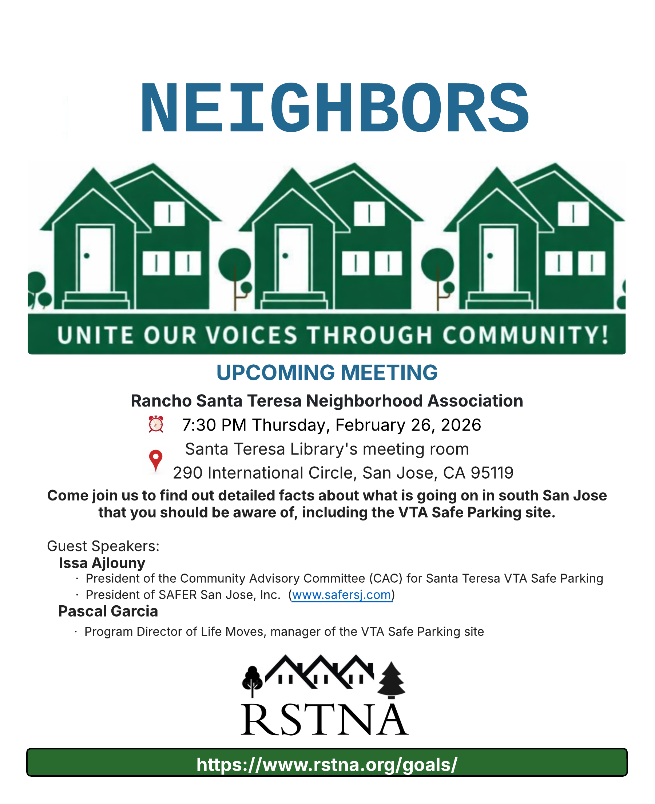

# Upcoming Events

## National Night Out - Aug 4, 2026

The best way to build a safer community is to know your neighbors and your surroundings.  National Night Out provides a great opportunity to bring police and neighbors together under positive circumstances.

----

# Meetings

## General Meeting - Feb 26, 2026

The February meeting will provide RSTNA Committee updates and a presentation on the VTA Safe Parking Site.  See flyer below for more information.

Please review
* [2025 Summer Survey](../survey-summer-2025/) - [doc](../RSTNA-SurveyResultsSummary-2025-06-08.docx)
* [Minutes of the June 2025 Meeting](../2025-june-minutes/) - [doc](../RSTNA-MeetingMinutes-2025-06-13.docx)

&nbsp;

For RSTNA history and earlier events, please see [History](../history).