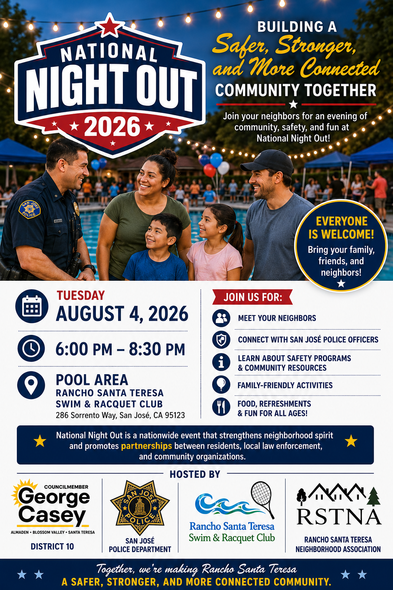

# Upcoming Events

## National Night Out - Aug 4, 2026

The best way to build a safer community is to know your neighbors and your surroundings.  National Night Out provides a great opportunity to bring police and neighbors together under positive circumstances.  See [flyer below](#national-night-out-flyer).

## San José City Council – Vote on Zoning Change

- [Information Meeting](../zoning-code-change/#meeting-on-august-5): **Aug 5, 2026**
- [City Council Vote](../zoning-code-change/#meeting-on-august-18): **Aug 18, 2026**

The San José City Council will be voting on a major change in the city’s zoning laws.  (See [details here](../zoning-code-change))   Two important changes that could impact our neighborhood:

- Increase the density in the Residential Neighborhood land use designation from 8 DU/AC (Dwelling Units/Acre) to 32 DU/AC
- Allow a maximum building height of 35 feet and 3 stories in Residential Neighborhood

These changes would be extremely significant and would change the nature of the neighborhood because it would allow four dwelling units on a 60’x100’ lot as opposed to the current zoning that allows only one dwelling unit.

## Information Meeting

- Date: Wednesday, **August 5, 2026**
- Time: **5:30 pm**
- Location: **Vineland Branch Library**, 1450 Blossom Hill Road San José
- See [flyer](../zoning-code-change/#flyer)

## City Council Meeting (includes voting on the recommendations)

- Date: Tuesday, **August 18, 2026**
- Time: TBD
- Location: **San José City Hall**, 200 E. Santa Clara St., San José

For more information see: [RSTNA Community Action Chair comments](../zoning-questions/)

To submit comments: [Send Comments to City of San José](../zoning-code-change/#send-comments-to-city-of-san-josé)

## Car Theft and Vandalism: Aug 13

Recently there have been a rash of car thefts and vandalism in the Rancho Santa Teresa Swim and Racquet Club area. The San José Police Department and the Rancho Santa Teresa Neighborhood Association (RSTNA) will be presenting a program on preventing car theft and vandalism.

- Date: Thursday, **August 13, 2026**
- Time: **7:00 pm**
- Location: **Clubhouse**, 286 Sorrento Way, San Jose, CA 95119

## Dumpster Day - Sep 26, 2026

Councilmember George Casey and RSTNA are sponsoring a Dumpster Day for the local community from 9-noon. More information to come.

## General Meeting - Oct 15, 2026 (tentative date)

The October meeting will provide RSTNA Committee updates and a presentation - topic to be determined. More information to come.

## District 10 Events

Visit the [District 10 webpage](https://www.sjdistrict10.org/events) to find out about upcoming events in our District.

## National Night Out Flyer

----

# Past Meetings

For RSTNA history and earlier events, please see [History](../history).

## General Meeting - Feb 2026

The February meeting included RSTNA Committee updates and a presentation on the VTA Safe Parking Site.
* [Minutes of the Feb 2026 meeting](https://s06.circleweaver.com/weaver/t/rstna/main-committee/MeetPrint.htm?id=8710&tem=MinutesDetails.chtml&mnm=R9B5P4Q2)
* [Presentation Slides - Safe Parking](https://docs.google.com/presentation/d/1ztMnPkTu8qkj8DIO9xOCZhEQ645H3b_Pk7-1oVwsaAg/edit?slide=id.g3aeb524acb5_2_75#slide=id.g3aeb524acb5_2_75)

## General Meeting – Oct 2025

The October meeting included RSTNA Committee updates and a presentation on Earthquake Preparedness.  

* [Minutes of the Oct 2025 meeting](https://s06.circleweaver.com/weaver/t/rstna/main-committee/MeetPrint.htm?id=6858&tem=MinutesDetails.chtml&mnm=A5N5O4Q2)
* [Presentation Slides - Emergency Preparedness](../RSTNA-Preparedness-2025-10.pdf)

 
## General Meeting – Jun 2025
At the June meeting, Bill Wolf, acting RSTNA President, introduced the acting RSTNA officers and committee chairs.  George Casey, San José Councilmember for District 10, emphasized the importance of neighborhood associations and Community Emergency Preparedness Teams (CERTs).  The [survey results](../survey-summer-2025/) were shared, and attendees met with and signed up for committees.

* [Minutes of the June 2025 meeting](../2025-june-minutes/) - [doc](../RSTNA-MeetingMinutes-2025-06-13.pdf)
* [2025 Summer Survey](../survey-summer-2025/) - [doc](../RSTNA-SurveyResultsSummary-2025-06-08.pdf)

&nbsp;

