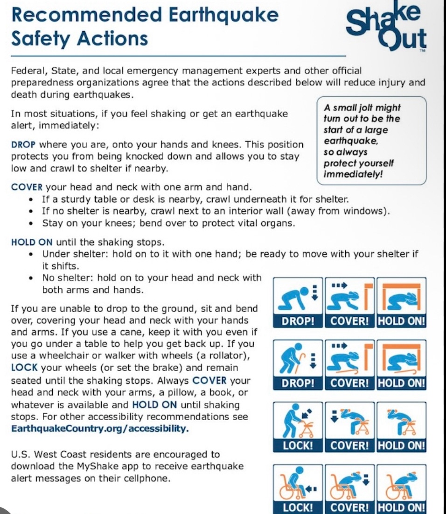
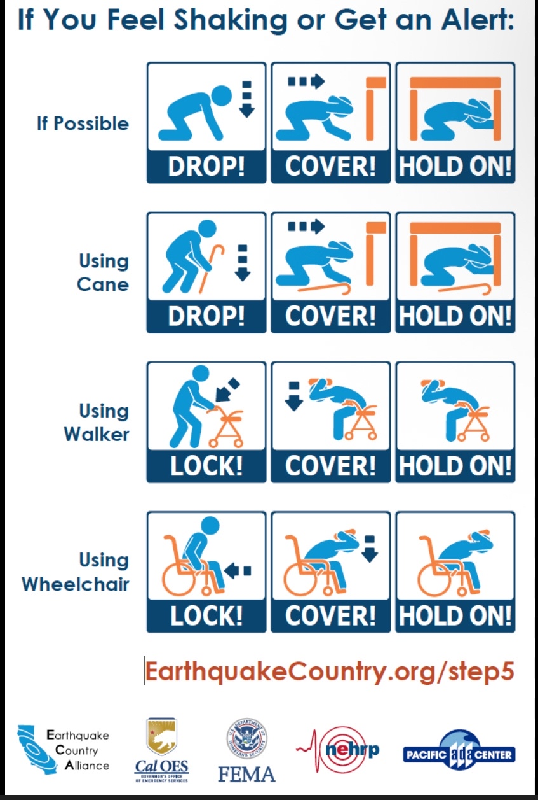

# Notes & Tidbits

## Privacy - DROP (Delete Request and Opt-out Program) 

Californians can submit one, simple request to stop all data brokers from selling their personal information.  Data brokers, who often collect and trade personal information without people’s knowledge, must begin processing these requests by August 2026.  Visit https://privacy.ca.gov/drop to verify your California residency and send a deletion request.

## Emergency Preparedness - Personal Emergency Preparedness

[Presentation Slides - Personal Emergency Preparedness](../RSTNA-Preparedness-2025-10.pdf)

## Emergency Preparedness - Recommended Earthquake Safety Actions

Recommended Earthquake Safety Actions (right-click to display image and print it!):

If you feel shaking, quick actions:

