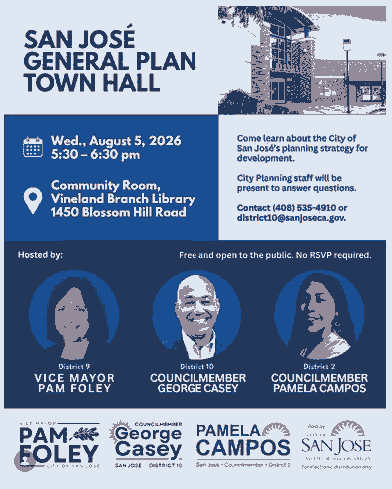

# Important Proposed Changes to San José Zoning Code

Important proposed changes to the zoning code will be voted upon at the City Council’s August 18 meeting (full proposal in Memorandum; link below). The changes, if passed, would include:

- Increase the density in the Residential Neighborhood land use designation from 8 DU/AC (Dwelling Units/Acre) to 32 DU/AC
- Allow a maximum building height of 35 feet and 3 stories in Residential Neighborhood

These changes would be extremely significant and would change the nature of the neighborhood because it would allow four dwelling units on a 60’x100’ lot as opposed to the current zoning that allows only one dwelling unit. 

Whether you would be opposed to the changes or would favor them, it is very important for you to attend the City Council Meeting and testify, if possible, because we understand it has a greater impact. No testimony has to exceed a single sentence.

If you cannot attend in person, you can submit your comments (see separate link on this website).

## Meeting on August 5

Attend information meeting with city staff and elected representatives

- Date: **August 5, 2026**
- Time: **5:30 pm**
- Location: **Vineland Branch Library**, 1450 Blossom Hill Road San José
- Flyer: See below

## Meeting on August 18

- Date: **August 18, 2026**
- Location: **San José City Hall**, 200 E. Santa Clara St., San José

Agenda with time and Staff Report will be posted at least 10 days before the
hearing at the following link:
[https://sanjose.legistar.com/DepartmentDetail.aspx?ID=21676&GUID=ACCCCFF5-F14A-4E1A-8540-9065F45A8A](https://sanjose.legistar.com/DepartmentDetail.aspx?ID=21676&GUID=ACCCCFF5-F14A-4E1A-8540-9065F45A8A)

## Resources

Families and Homes opposes the proposed changes: [https://www.familieshomessj.org/](https://www.familieshomessj.org/)

San José YIMBY favors more housing: [https://sanjoseyimby.org/](https://sanjoseyimby.org/)

The Bay Area News Service reported on housing advocates and neighborhood
groups taking different positions:
[https://www.sfgate.com/news/bayarea/article/san-jose-spotlight-battle-lines-drawn-in-san-22342046.php](https://www.sfgate.com/news/bayarea/article/san-jose-spotlight-battle-lines-drawn-in-san-22342046.php)

Letters from the public commenting on the proposed changes can be found at this
link:
[https://www.sanjoseca.gov/home/showpublisheddocument/132736/639179131709570000](https://www.sanjoseca.gov/home/showpublisheddocument/132736/639179131709570000)

Memorandum from the Director of Planning, Building, and Code-Enforcement Department to the Planning Commission – Subject General Plan Four-year Review Policy Framework: [https://www.sanjoseca.gov/home/showpublisheddocument/132627/639179132404900000](https://www.sanjoseca.gov/home/showpublisheddocument/132627/639179132404900000)

## Send Comments to City of San José

You can send comments to City of San José officials by preparing an email and
sending it to individual officials or to all officials. Here are the email addresses:

- Mayor Matt Mahan: matt.mahan@sanjoseca.gov
- Vice Mayor Pam Foley: pam.foley@sanjoseca.gov
- City Clerk: city.clerk@sanjoseca.gov

Representatives:
- Anthony Tordillos: anthony.tordillos@sanjoseca.gov
- Bien Doan: bien.doan@sanjoseca.gov
- David Cohen: david.cohen@sanjoseca.gov
- Domingo Candelas: domingo.candelas@sanjoseca.gov
- George Casey: george.casey@sanjoseca.gov
- Michael Mulcahy: michael.mulcahy@sanjoseca.gov
- Pamela Campos: pamela.campos@sanjoseca.gov
- Peter Ortiz: peter.ortiz@sanjoseca.gov
- Rosemary Kamei: rosemary.kamei@sanjoseca.gov

To easily email everyone, use the following list:

matt.mahan@sanjoseca.gov, pam.foley@sanjoseca.gov, city.clerk@sanjoseca.gov, anthony.tordillos@sanjoseca.gov, bien.doan@sanjoseca.gov, david.cohen@sanjoseca.gov, domingo.candelas@sanjoseca.gov, george.casey@sanjoseca.gov, michael.mulcahy@sanjoseca.gov, pamela.campos@sanjoseca.gov, peter.ortiz@sanjoseca.gov, rosemary.kamei@sanjoseca.gov

## Flyer

